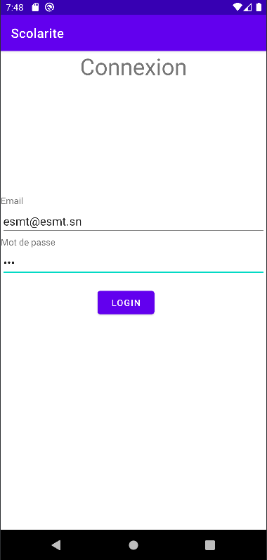
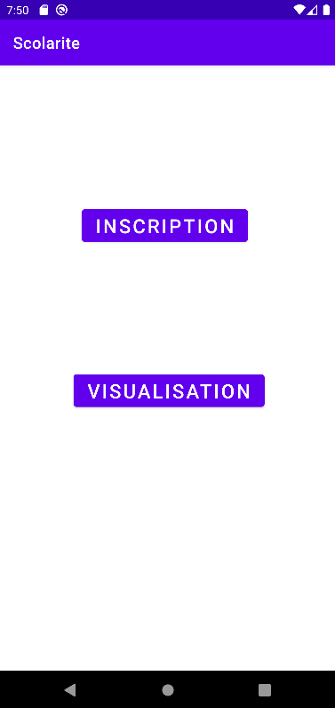
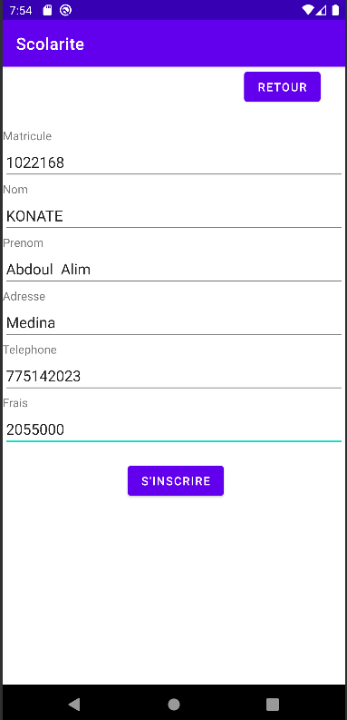
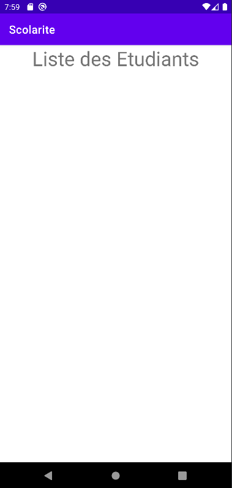

## Scolarite
Ce projet est une application Android destinée à la gestion des étudiants

## Fonctionnalités"

Ce projet est une application Android destinée à la gestion de la scolarité des étudiants.

 - Accueil (Home) : Page d'accueil de l'application affichant des informations générales sur l'établissement.

 - Connexion (Login) : Permet de se connecter à l'application.

 - Inscription (Inscription) : Permet d'inscrire des étudiants.

 - Liste des Étudiants (Liste Etudiants) : Affiche une liste des étudiants inscrits.

## Captures d'écran

Connexion (Login)

Accueil (Home)

Inscription (Inscription)

Liste des Étudiants (Liste Etudiants)

## Technologies Utilisées 
. Java
. Android Studio
. Retrofit (pour les requêtes HTTP)
. Gson (pour la sérialisation/désérialisation JSON)
